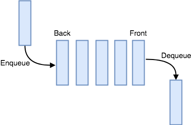

# Queue

Queue
Imagine yourself going to the bank, when you arrive you get the turn 25, and suddenly you notice they’re still on turn 3. Probably not the most pleasant trip, most likely you’ve been in this situation and desired to skip the line and go directly in front of the line. Unfortunately, things don’t work like that, and as with the line in a bank, Queues share essentially those characteristics.

In Computer Science Queues are a type of data structure that are known to be “First In, First Out” (FIFO). Following the example above, the person next in the line would be called the ‘front’, and the end of the line would be called the ‘back’. When ever a person joins the line, we call that process an ‘enqueue’, and when someone is removed from the front of the line is called a ‘deque’. 



As with the line of a bank, you can’t simply go to the front of the line and hope to be attended. You need to go to the back and wait to be called, the same happens in a Queue. In other words, a Queue is an ordered collection of elements where you can only add from the back and remove from the front.

## Enqueue & Dequeue

As explained before, in a Queue we have the enqueue and dequeue operations. Let’s begin diving a little deeper into the enqueue. On Python you can use a list to represent a Queue, and to  implement the enqueue operation we do the following:

```python

#Let's first declare the list we will use as queue
my_queue = []

# Add the 'value' to the end of the list
my_queue.append(value)

```
As you can see, the operation for adding a new value is pretty simple. In fact, the performance to accomplish this is the fastest we can get, an __O(1) performance__. 

Now, that we explained how to accomplish an enqueue, let’s talk about the dequeue. Recalling to the introduction, the dequeue operation will remove the value from the first element of the queue. As with the enqueue let us demonstrate this operation using a Python list:

```python
# To accomplish a dequeue we have two options:

# First, let's save the value and then we can directly remove it from the list
value = my_queue[0]
del my_queue[0]

# Or, we can pop off index 0
value = my_queue.pop(0)
```
In this situation once the value is removed from the front of the list, the rest of the values will have to move their index one spot ahead of the line. Therefore, we will need to loop the list once, and the efficiency becomes an __O(n) performance__.

Aside from these two major operation, we also some common operation used in this data structure. These are to __find out the size__  and to __check if is empty__. Here are an example of the implemantation using Python lists:

```python
# Check the size
size = len(my_queue)

# Check if it's empty
if len(my_queue) == 0:
    # Do something
```
These two operations have an excellent efficiency. Like enqueue they are an __O(1) performance__, checking the size of a 1000 elements queue will take the same amount of time as checking for a 1 element queue. Overall, the efficiency of a queue is very good. 

## Applications

We can see the usage of queues quite commonly in our everyday life, here are some examples of queue applications:

* _Printers:_ we normally send our pages to print and if we send another file, it will be printed after it has done printing the first one. Remember the logic, first in, first out. 
* _Process Scheduling:_ All the processes running in your computer now, are on a wait line inside a queue waiting to be executed. Usually there are some other algorithms that decide priority, but essentially they are on a queue.
* _Call Centers:_ who ever had worked in a call center or called to one, you usually receive a message saying you are next in a line. The system manages the incoming calls in a queue and processes them according to their turn un line.

These are just a few applications we can see on real life.

## Example : Turns in Line
Now that we have discussed some of the properties of Queues, let’s demonstrate an example of this data structure. As we mentioned earlier, you might wan to use this data structure when you need to give turns like in printers or call centers.

In this situation let’s think about the following. We have a small company that offers a service and takes exactly 10 seconds to make the order. They just take one order at a time, and have some other requisites, here are their requirements:

* Ask the client how many turns they are going to attend
* Based on the turns, create a queue for those turns
* Every turn takes exactly 10 seconds to be attended
* Display the turn they are currently working on

```python

# Let's declare our queue
my_queue = []

# We need to figure out how many turns we are going to need
number = int(input('How many turns do we need?: '))

for num in range(1,number+1):
    # This will be use to Enqueue every element to the list
    my_queue.append(num)

turn = 0

# Library to help us set time sleep
from time import time, sleep

# Let us be in a loop until we are done with all turns
while turn < number:
    print("\nTurn in line: ", my_queue[0])

    # Here we are going to Dequeue oir list
    my_queue.pop(0)
    turn = turn + 1

    # Code to keep running the loop every 10 seconds
    sleep(10)

print('\nAll turns have been attended.')
print('Have a nice day!')

```

## Problem to Solve : Are you done?

Write a program that will determine the amount of turns to be attended and asks the user when he’s done to go to next turn.
The requirements are:
* Prompt the user the number of turns
* Create a queue given the number of turns
* Display the turn they are currently working on
* Prompt the user if he is done, unless he explicitly states he is ‘done’ don’t go to the next turn

You can test your program with the following scenarios:


| Turns | Prompt | Result|
|-------|--------|-------|
|   1   |   No   | Won't advance |
|   3   |  done  | Will advance  |
|   5   |  Done  | Will advance  |
|   0   |  What? | Already finish   |


You can check your code with the solution here: [Solution](solution-queue.py)


[Back to Welcome Page](0-welcome.md)
