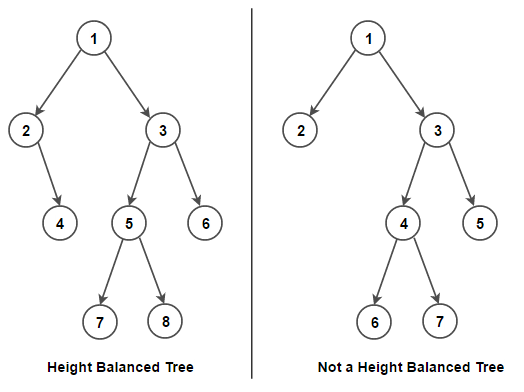

# Tree
Up to this point the data structures we’ve seen has been what are called “linear” data structures, they have a logical start and a logical end.  Trees on the other hand don’t follow this linear way, they have a different method for storing data, they organized data hierarchically.

To illustrate this better think about your family tree, you don’t just have one end connected to another end, there are branches and leaves. Here is an example of my family tree:


This is an example of hierarchy, you can start from me and follow two different paths on the next level, my dad, and my mom. You have me at one end, and there are more than 1 ways to reach another end, trees are somewhat like this and we will explain it here.

## Definition
Trees are a collection of nodes that are connected by edges. Nodes are the basic unit of the trees and they contain data and may have or not have child nodes. A tree has the following general properties and characteristics:

* __Root node__ every tree has a root which is the first node of the tree
* __Edge__ is the link between two nodes
* __Parent node,__ if two nodes are connected, the node with the highest hierarchy is the parent, for example, if the root node is connected to another node the root would be the parent
* __Child node__ is a node that has a parent node
* __Leaf__ these are the nodes that don’t have a child node in the tree
* __Height__ is the length of the longest path to a leaf
* __Depth__ is the length of the path from the root to a node


## Binary Tree

Binary trees are a specific type of trees, Wikipedia give us a nice and simple definition.

> _"In computer science, a binary tree is a tree data structure in which each node has at most two children, which are referred to as the left child and the right child."_ [Wikipedia](https://en.wikipedia.org/wiki/Binary_tree)

The following is a Python class representation of a node from a Binary Tree.

``` python
# Representation of single node in a Binary Tree
class Node:
    def __init__(self,data):
        self.left = None
        self.right = None
        self.data = data
```
Notice data is being send as a parameter and being set as data, also that the left and right childs are being set to 'None'. This is because when a node is created, it doesn't have any children, keep that in mind. We will return to it in a bit, but before that let's discuss two more concepts, recursion and Binary Search Tree (BST).

## Recursion

It is a technique for functions to call themselves. Here an example:

``` python
def hello_world():
    print('Hello World!')
    hello_world()   # Recursive call 
```
When implementing recursion you need to be careful when to call it, and have parameters to make it stop. In the example above it would call it self forever.

## Binary Search Tree
This is a node-based binary tree data structure, it inherits the properties explained of trees and binary trees, and additional to it, it keeps elements as a sorted list of numbers. This type of tree has the following properties:

* The left subtree of a node contains only nodes with keys smaller than its parent
* The right subtree of a node contains only nodes with keys greater than its parent
* Every subtree must be a binary search tree (BST)


__Balanced BST:__ we can consider a balanced BST when the height between any two subtrees is not significantly different. 



### BST Operations

There are several common operations done in BST, we will explain a few of them.

``` python
# We will create our own class for BST and be adding functions for every operation we will explain
class BST:

    # We need this class for the nodes
    class Node:

        def __init__(self, data):
       
            self.data = data
            self.left = None
            self.right = None

    # As a default we will set our root to none
    def __init__(self):

        self.root = None
```

__Insertion,__ we insert a value into the tree.

```python
# For the insertion we are going to recursively search the subtrees to find the next available spot

    def insert(self, data):

        if self.root is None:
            self.root = BST.Node(data)
        else:
            self._insert(data, self.root)  # Start at the root

    def _insert(self, data, node):

        if data != node.data:
            if data < node.data:
                # The data belongs on the left side.
                if node.left is None:
                    # We found an empty spot
                    node.left = BST.Node(data)
                else:
                    # Need to keep looking.  Call _insert
                    # recursively on the left sub-tree.
                    self._insert(data, node.left)
            else:
                # The data belongs on the right side.
                if node.right is None:
                    # We found an empty spot
                    node.right = BST.Node(data)
                else:
                    # Need to keep looking.  Call _insert
                    # recursively on the right sub-tree.
                    self._insert(data, node.right)
```

__Contains,__ it will determine if a value is in the tree.

```python
# To check for a value, we will recursively search the subtrees to find the value.
    def __contains__(self, data):

        return self._contains(data, self.root)  # Start at the root

    def _contains(self, data, node):

        if self.root is not None:
            if data < node.data:
                # The data belongs on the left side.
                if node.left is None:
                    # We found an empty spot
                    return False
                else:
                    # Need to keep looking.  Call _insert
                    # recursively on the left sub-tree.
                    return self._contains(data, node.left)
            elif data > node.data:
                # The data belongs on the right side.
                if node.right is None:
                    # We found an empty spot
                    return False
                else:
                    # Need to keep looking.  Call _insert
                    # recursively on the right sub-tree.
                    return self._contains(data, node.right)
            else:
                return True
```
__Traverse forward__ visits all objects from smallest to largest.

```python
# It will recursively traverse the left subtree and then the right subtree
    def __iter__(self):

        yield from self._traverse_forward(self.root)  # Start at the root
        
    def _traverse_forward(self, node):

        if node is not None:
            yield from self._traverse_forward(node.left)
            yield node.data
            yield from self._traverse_forward(node.right)
```
__Traverse reverse__ visits all objects from largest to smallest.

```python
# It will recursively traverse the right subtree and then the left subtree
    def __reversed__(self):
      
        yield from self._traverse_backward(self.root)  # Start at the root

    def _traverse_backward(self, node):

        if node is not None:
            yield from self._traverse_backward(node.right)
            yield node.data
            yield from self._traverse_backward(node.left)
```

We can get the __height__ of a node.
```python
# Recursively find the height of the left and rigth subtrees and then return the maximun height
    def get_height(self):

        if self.root is None:
            return 0
        else:
            return self._get_height(self.root)  # Start at the root

    def _get_height(self, node):

        if node != None:
            leftHeight = self._get_height(node.left)
            rightHeight = self._get_height(node.right)
            if leftHeight > rightHeight:
                return leftHeight + 1
            else:
                return rightHeight + 1
                
        return 0
```

| Operation | Performance |
|-------|--------|
|   Insertion   |   O(log n)   |
|   Contains   |  O(log n)  |
|   Traverse Forward   |  O(log n)  | 
|   Traverse Reverse   |  O(log n)  | 
|   Height   |  O(log n) |

## Example : Books on the shelf

Let's start our journey by placing all of the above into one class. 

```python
"""
Some functions are own by BYU-Idaho.
This is intended only to be for teaching purposes.
"""

# Declaration of our BST class
class BST:

    # We need a node class
    class Node:

        def __init__(self, data):

            self.data = data
            self.left = None
            self.right = None

    def __init__(self):

        self.root = None

    # Functions to perfom the insert operation
    def insert(self, data):

        if self.root is None:
            self.root = BST.Node(data)
        else:
            self._insert(data, self.root)

    def _insert(self, data, node):

        if data != node.data:
            if data < node.data:
                if node.left is None:
                    node.left = BST.Node(data)
                else:
                    self._insert(data, node.left)
            else:
                if node.right is None:
                    node.right = BST.Node(data)
                else:
                    self._insert(data, node.right)

    # Functions to perfom the contains operation
    def __contains__(self, data):

        return self._contains(data, self.root)

    def _contains(self, data, node):

        if self.root is not None:
            if data < node.data:
                if node.left is None:
                    return False
                else:
                    return self._contains(data, node.left)
            elif data > node.data:
                if node.right is None:
                    return False
                else:
                    return self._contains(data, node.right)
            else:
                return True

    # Functions to perfom the traverse forward operation
    def __iter__(self):

        yield from self._traverse_forward(self.root)
        
    def _traverse_forward(self, node):

        if node is not None:
            yield from self._traverse_forward(node.left)
            yield node.data
            yield from self._traverse_forward(node.right)
    
    # Functions to perfom the traverse reverse operation
    def __reversed__(self):
       
        yield from self._traverse_backward(self.root)

    def _traverse_backward(self, node):

        if node is not None:
            yield from self._traverse_backward(node.right)
            yield node.data
            yield from self._traverse_backward(node.left)

    # Functions to perfom the get height operation
    def get_height(self):

        if self.root is None:
            return 0
        else:
            return self._get_height(self.root)

    def _get_height(self, node):

        if node != None:
            leftHeight = self._get_height(node.left)
            rightHeight = self._get_height(node.right)
            if leftHeight > rightHeight:
                return leftHeight + 1
            else:
                return rightHeight + 1
        
        return 0
```

Usually problems solved with binary trees tend to be more professional, and for this occasion we will allow ourselves to be creative.

Let's say you are on your English class, and you have this big bunch of books (in reality there are only 7 books, but we all know how heavy are books so 7 is a lot for us). And you might be weak, but a very orderly person, so you assignated every book a number from 1 to 7.

Now, you are not only taking an English, but a fascinating Data Structure class and you thought "Hey! I have like 30 minutes free before lunch, let's test our BST knowledge using my books data" (Don't ask why, but that was your thought). 

For this example we will want to save all the data of the books creating a balanced tree, get the height and print the info backwards.

```python
# To get a balanced tree remember height between any subtree must not be significantly different. To accomplish this we need to start from the middle, so that both sides get the same amount of data

# Let's create our tree
bookTree = BST()

# Inserting our data
bookTree.insert(4)
bookTree.insert(2)
bookTree.insert(6)
bookTree.insert(1)
bookTree.insert(3)
bookTree.insert(5)
bookTree.insert(7)

# Thanks to the way we inserted our data, our tree would look something like this
#        _______4_____
#       /             \
#      2__          ___6
#     /   \        /    \
#    1     3      5      7
# 
# As you can see, this is an example of a balanced BST!

# Note: there are algorithm that would allow us to insert lists in an orderly way, isn't that amazing?! Keep that in mind for the next section.

# To get our height we just need to call our function
bookTree.get_height()
# Returns 3
# You can verify that with our diagram above

# Finally, remember we wanted to get our tree data backwards, let's code it
for x in reversed(bookTree):
    print(x)
    # Prints: 7, 6, 5, 4, 3, 2, 1
```

There we go, that is how we would implement our BST class in that situation.

## Libraries 
Luckily for us, we can use libraries to help us facilitate the code. There are several libraries that generates trees for use, I will only mention one, but there are more. Binarytree is one library for studying binary trees, this is the link to their GitHub repository [Binarytree](https://github.com/joowani/binarytree).


## Problem to Solve : How many nodes we have?

There are sometimes data will be sent to us and we may lose count of the amount of values sent. On this occasion we want to implement a get_size function. 

As a starter point we will use the BST class we have previously used, you are allowed to implement your new function using functions inside the BST class.

Here is a template of a BST class: [BST Template](template-BST.py)

__Hint:__ Try to read and understand the code in the template and our examples, remember that gaining that ability is a very useful one in our developers toolbox.

You can check your code with the solution here: [Solution](solution-tree.py)


[Back to Welcome Page](0-welcome.md)